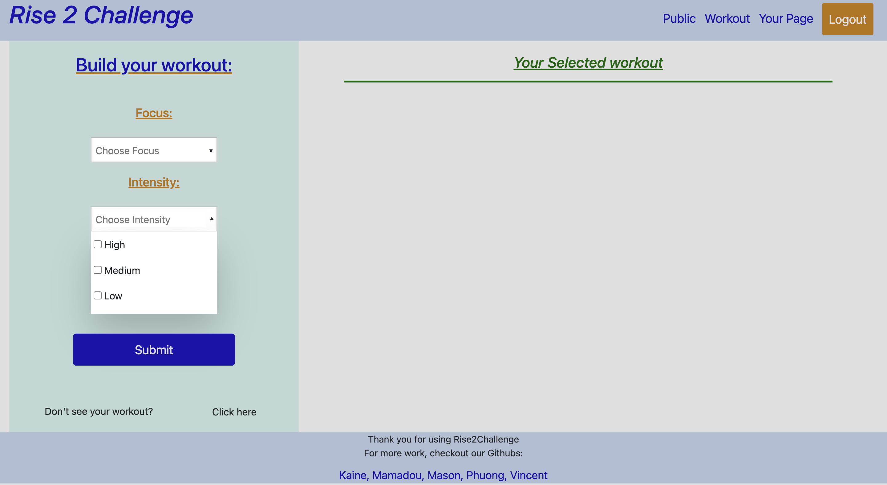

# Rise2Challenge

## License
### 
### [MIT](https://opensource.org/licenses/MIT)

## Description

A workout tracker where you can choose your exercise focus and intensity and build current/future workouts through RESTful API application standards.

## Table of Contents

* [Installation](#installation)

* [Tests](#tests)

* [Usage](#usage)  

* [Future Improvements](#future-improvements)

* [Bugs](#bugs)

* [Contributors](#contributors)

* [Questions?](#questions)

## Installation

* Head to the repository to download or view this code: [Rise2Challenge](https://github.com/JayWhiteBuffalo)

*  If you want to use/make changes to the back end download the code from this repository 

* npm i -y 

* npm run 

* If you would like our seed data, node seed/index.js

## Tests

[Heroku Deployment Link](https://thawing-atoll-91539.herokuapp.com/)

## Usage

* Use the live link above to explore and use the application.

## Future Improvements

* Make the page more social, by adding comments and shared favorites

* Further aesthetic improvements

* Connect personal contact information so members of Risers can communicate

## Bugs

* PUT BUGS HERE !!!

## Contributors

* [Vincent](https://github.com/Vincenttoon) [Mason](https://github.com/JayWhiteBuffalo), [Phuong](https://github.com/PhuongHoang68), [Mamadou](https://github.com/mamadou1991), [Kaine](https://github.com/kainew5843), 

## Questions?

Questions, comments, or concerns? Please Email me at:
* vincenttoon22@gmail.com
* masonsemail@email.com
* phuongsemail@email.com
* mamadousemail@email.com
* kainesemail@email.com